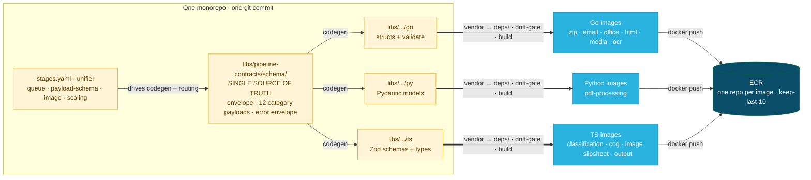
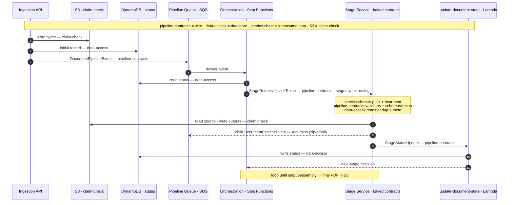
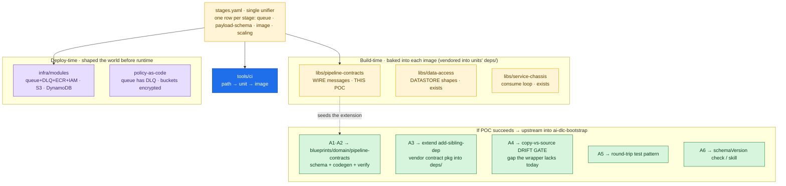

# Document Processing Pipeline — Monorepo View: contracts baked into images

A re-sketch from the **monorepo point of view**. The earlier version drew the contract as a
*published, versioned artifact* (`@opus2/pipeline-contracts` pushed to a private registry) — the
**polyrepo / Pact-broker** model. The real project is a **monorepo + microservices** combo, so the
contract is *not* a deployable, not published, and has no broker. It is an **internal `libs/`
package compiled *into* each service image at build time**; only the **wire envelope** crosses a
queue at runtime.

The two things people conflate as "the contract":

| | The contract **package** | The contract **on the wire** |
|---|---|---|
| What | `libs/pipeline-contracts/{go,py,ts}` — codegen'd types + validators | The SQS message body: `schemaVersion` · claim-check · trace context · `category` payload |
| When | **Build time** | **Runtime** |
| Where | Source in the repo; **baked into every consuming image** | Travelling *between* running Pods, via the queue |
| Deployable? | **No** — never an image, ECR repo, or Pod | Not an artifact — it is the *agreement* the images honor |

---

## View 1 · Build time — one repo → one library → many images

The single schema is the source of truth; codegen emits one flavor per language; each flavor is
compiled **into** the images of services written in that language; each image is pushed to its own
ECR repo. There is no "contract service" — a copy of the contract lives *inside* every consumer.

**Blast radius (path-filtered CI):** change `units/<x>/**` → rebuild **only** that one image.
Change `libs/pipeline-contracts/**` → **rebuild every consuming image** — the deliberate fan-out
that keeps every image's embedded contract copy in lockstep. One commit ⇒ one contract version
embedded everywhere; no version skew, no registry, no broker.

---

## View 2 · Runtime — images talk; the wire envelope is the only thing that crosses

Each running Pod carries its **embedded** contract copy (the amber chip), uses it to serialize
outbound and validate inbound, and shares heavy state only through S3 (claim-check). No Pod imports
another; they agree only on the **shape of the message**.

```mermaid
flowchart LR
    subgraph WIRE["The wire envelope (embedded in every image · NOT a service)"]
        direction TB
        ENV["Envelope spine<br/>schemaVersion · messageId · correlationId<br/>pipelineExecutionId · tenantId · documentId<br/>source bucket+key · taskToken? · traceparent"]
        CING["DocumentPipelineEvent"]
        CREQ["StageRequest · 12 stage variants"]
        CSTA["StageStatusUpdate"]
        ENV --> CING
        ENV --> CREQ
        ENV --> CSTA
    end

    subgraph L1["1 · Ingestion & Orchestration"]
        direction TB
        API["Ingestion API<br/>(GraphQL)"]
        DPQ[["Document Pipeline Queue<br/>(SQS · tenant-fair)"]]
        ORCH{{"Orchestration<br/>(Step Functions)"}}
        API -->|DocumentPipelineEvent| DPQ
        DPQ --> ORCH
    end

    subgraph L2["2 · Classify"]
        direction TB
        CLS["classification-service image (TS)<br/>+ embedded contract"]
        RT{"6 routes"}
        CLS --> RT
    end
    ORCH -->|"StageRequest: classify"| CLS

    subgraph STAGES["3 · Stage Service images (each queue-fronted · tenant-fair · contract baked in)"]
        direction TB
        subgraph G_EX["Extract"]
            ZIP["zip-extraction (Go)"]
            EML["email-extraction (Go)"]
        end
        subgraph G_CV["Convert (converters are external systems · Gotenberg is a separate image)"]
            OFF["office-convert (Go) · Aspose C++ SDK"]
            HTM["html (Go) · Gotenberg image"]
            COG["tiff-cog (TS)"]
            IMG["image-tiff (TS)"]
            MED["media (Go)"]
            SLP["slipsheet (TS)"]
        end
        subgraph G_VO["Validate · OCR · Register"]
            PDF["pdf-processing (Py)"]
            OCR["ocr (Go)"]
            OA["output-assembly (TS)"]
        end
    end

    RT -->|archive| ZIP
    RT -->|email| EML
    RT -->|convert| G_CV
    RT -->|pdf| PDF
    RT -->|ocr| OCR
    RT -->|output| OA
    ZIP -.->|child docs re-enter| DPQ
    EML -.->|attachments re-enter| DPQ

    subgraph L4["4 · Shared State & Status"]
        direction TB
        S3[("Document Storage<br/>(S3 · claim-check)")]
        SU["update-document-state<br/>(Lambda · zip artifact, not an image)"]
        STAT[("Document Status<br/>(DynamoDB)")]
        SU --> STAT
    end

    STAGES -. "claim-check r/w" .- S3
    STAGES ==>|StageStatusUpdate| SU
    STAT -.->|next-stage decision| ORCH

    CING -. governs .-> DPQ
    CREQ -. governs .-> STAGES
    CSTA -. governs .-> SU

    classDef contract fill:#fff4d6,color:#5a3d00,stroke:#d9a400,stroke-width:1px;
    classDef sys fill:#1f6feb,color:#fff,stroke:#0b3d91;
    classDef svc fill:#2bb3e0,color:#fff,stroke:#127a9e;
    classDef q fill:#7fd4ef,color:#06384a,stroke:#127a9e;
    classDef store fill:#0a4d68,color:#fff,stroke:#063;
    classDef route fill:#ffd966,color:#3d2e00,stroke:#bf9000;
    class ENV,CING,CREQ,CSTA contract;
    class API,ORCH,SU sys;
    class CLS,ZIP,EML,OFF,HTM,COG,IMG,MED,SLP,PDF,OCR,OA svc;
    class DPQ q;
    class S3,STAT store;
    class RT route;
```

## View 2b · A document's actual journey — from upload to final searchable PDF

Same runtime lens as View 2, but tracing a **real document** (not the contract): how the bytes flow through S3 (claim-check) and the stages transform *anything* into a **searchable PDF** returned to the client. Extraction fans children back in; conversion → validation → OCR all converge on Output Assembly.

```mermaid
flowchart LR
    UP["Upload: any document<br/>docx · xlsx · pptx · email · zip · image · audio/video · pdf"]
    API["Ingestion API (GraphQL)"]
    S3O[("S3 · original bytes")]
    DPQ[["Document Pipeline Queue (SQS)"]]
    ORCH{{"Orchestration (Step Functions)"}}
    CLS["Classify (TS)<br/>detect format · SHA-256 dedup · pick route"]
    RT{"6 routes"}

    UP --> API
    API -->|store original| S3O
    API -->|DocumentPipelineEvent| DPQ --> ORCH -->|StageRequest: classify| CLS --> RT

    EXT["Extract (Go)<br/>zip · email — fan out children"]
    CONV["Convert anything to PDF<br/>office · html · tiff-cog · image · media · slipsheet"]
    S3W[("S3 · working PDF")]
    VAL["PDF Processing (Py)<br/>validate · 3-stage repair · text-density"]
    OCR["OCR (Go · Textract)<br/>add searchable text layer"]
    OA["Output Assembly (TS)<br/>merge · searchable PDF · word index"]
    S3F[("S3 · final searchable PDF")]
    OUT["Returned to client<br/>searchable PDF + metadata"]

    RT -->|archive · email| EXT
    RT -->|convert| CONV
    RT -->|already pdf| VAL
    RT -->|needs text| OCR
    RT -->|assemble| OA

    EXT -.->|each child / attachment re-enters| DPQ
    CONV -->|working PDF| S3W
    S3W --> VAL
    VAL -->|scanned · low text| OCR
    VAL -->|already has text| OA
    OCR --> OA
    OA -->|final| S3F
    S3F --> OUT

    classDef sys fill:#1f6feb,color:#fff,stroke:#0b3d91;
    classDef svc fill:#2bb3e0,color:#fff,stroke:#127a9e;
    classDef q fill:#7fd4ef,color:#06384a,stroke:#127a9e;
    classDef store fill:#0a4d68,color:#fff,stroke:#063;
    classDef route fill:#ffd966,color:#3d2e00,stroke:#bf9000;
    classDef io fill:#d7f5dd,color:#0b3d1f,stroke:#1a7f37;
    class API,ORCH sys;
    class CLS,EXT,CONV,VAL,OCR,OA svc;
    class DPQ q;
    class S3O,S3W,S3F store;
    class RT route;
    class UP,OUT io;
```

## View 3 · Execution flow — where each contract is touched

One document's journey through the pipeline. The same **contract sandwich** repeats at every stage:
`service-chassis` runs the consume loop, `pipeline-contracts` validates inbound / serializes outbound
(with the `schemaVersion` check), `data-access` shapes every DynamoDB / S3-metadata touch, and the
**claim-check** keeps heavy bytes in S3. `infra` + `stages.yaml` shaped the queues, buckets, tables and
routing *before* runtime; the three baked libs are enforced *during* it.

## View 4 · Contract family + the path into AI-DLC bootstrap

This POC builds only **pipeline-contracts** (the wire lib); the rest is the post-POC *family*.
`stages.yaml` is the single unifier all of them read. If the POC succeeds, its outputs upstream into
`ai-dlc-bootstrap` as a reusable contracts extension (each `A#` is a POC deliverable).

## How to read it

| Element | Meaning |
|---|---|
| **View 1 · 2 · 2b · 3 · 4** | Build time (repo → library → vendored into images → ECR); runtime (Pods exchanging the wire envelope); **(2b) a real document's journey from upload to final searchable PDF**; execution flow (where each contract is touched); contract family + the path into AI-DLC bootstrap. |
| Amber `WIRE` block | The contract is **embedded in every image**, not a lane you call into. It governs message shape only. |
| `==>` build edges | `codegen → compile into image` — the contract is folded into the artifact, not linked at runtime. |
| Per-image **ECR** | Each containerized unit → its own image → its own ECR repo, tagged & rolled independently. |
| `-. governs .->` | Ties each message family to the hop it validates: event→queue, request→stages, status→Lambda. |
| `-. claim-check r/w .-` | Heavy payloads live in S3; only the small envelope (S3 pointer) crosses the wire. |
| `-.->` dashed | Recursion: zip entries / email attachments re-enter as new documents. |
| Lambda / Gotenberg notes | Not everything is a built image: Lambdas ship as zip artifacts; Gotenberg is a pulled third-party image. |

**The point of this version:** the contract is reframed as a **build-time internal library baked
into ~17 images**, with the **wire envelope** as the only runtime crossing — and `schemaVersion`
stays mandatory because a queued message outlives a rolling deploy (old image produced it, new image
drains it). Monorepo ⇒ plain import, no broker; the "rebuild all consumers" path-filter rule keeps
every embedded copy consistent. This is the **monorepo + microservices** picture: one repo, many
images, one contract embedded everywhere.
