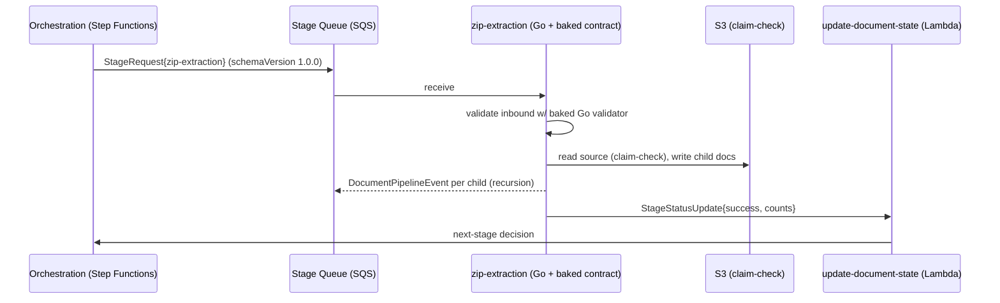

# Design Doc — Contracts Baked Into Images (POC)

**Status:** Draft · POC proposal
**Author:** awagh@opus2.com
**Companion artifact:** [`Approach_Pipeline_flowchart.md`](./Approach_Pipeline_flowchart.md) (the two-view picture this doc operationalizes)
**Worked-example consumers:** `zip-extraction` (Go) · `office-convert` (**one** image: Python orchestrator + C++ Aspose worker binaries baked into the same runtime stage)

---

## 0. Plain-language summary — for everyone

*No technical background needed. The rest of the document (§1 onward) is the detailed engineering version of what's below.*

### What we're building, in one picture

Our document system is really an **assembly line of about 12 specialist workers** — one decides what a file is, one unzips archives, one converts Office files to PDF, one runs OCR, and so on. They hand work down the line by passing each other small **"job slips"** (little messages that say *"here's the document, here's what to do next"*).

**The problem today:** every worker writes its *own* version of what a job slip should look like, by hand-copying from the others. When one worker changes its slip, nobody tells the rest. The slips slowly **drift out of sync**, and things break silently — and it's nobody's obvious fault.

**The fix:** write the job-slip format **once**, in a single shared place ("the contract"). A tool then automatically produces a copy in each worker's language, and that copy is **built right into each worker**. Now every worker is guaranteed to use the *exact same* slip. Change the master once → everything is rebuilt from it → nobody can fall out of date.

> **Everyday analogy.** Think of one **master recipe card**. A photocopier prints it in English, French, and Spanish. Each cook gets the printed card glued to their station. Because no cook ever hand-copies the recipe, no cook ends up cooking from a wrong or outdated version. "Baking the contract in" = gluing the card to the station, not leaving it on a shared noticeboard people forget to check.

### "One shared folder, but independent workers" (monorepo + microservices)

Two ideas that sound opposite but work together:
- **One shared folder for all the code** ("monorepo") — everything lives in one place, so changing things together is easy and consistent.
- **Independent workers when it runs** ("microservices") — each worker still runs on its own and can be sped up or slowed down independently.

So: **organized together, run separately.** This matches the architecture diagram (the ARD) the team agreed on.

### What this trial (the "POC") actually does

We're **not** rebuilding everything at once. We take **two real workers** — the **unzip** service and the **Office-conversion** service — and prove the whole idea on just them: one master slip, automatically copied into both, both reading and writing it correctly. If the small trial works, we know it's safe to roll out to all the workers.

### "Won't the AI assistant cost a fortune to build this?" (the token question)

Short version: **no — putting everything in one big shared folder does not make each job more expensive.** The AI only reads the *part it's working on*, not the entire folder — so adding more workers later doesn't raise the cost of each task. The one job that costs more is when we change the **master slip** and every worker needs updating — but that work splits into many small, independent pieces that can be done cheaply in parallel. With the assistant's "memory" (caching) switched on, it stays economical. **It's manageable, and this approach is actually cheaper than the alternative** of keeping every worker in its own separate folder.

### The three things to keep an eye on (plain terms)

1. One of the two trial workers (Office-conversion) is currently written in a **different programming language** than its eventual target. The trial still proves the idea, but not that exact final version — a known, deliberate gap.
2. When we update everything at once, **old and new versions briefly run side-by-side**; we design for that on purpose so nothing drops.
3. Merging two existing projects into one folder means **tidying up duplicate setup files** and carefully handling one **paid software licence file**.

### Bottom line

> One master "job slip", automatically copied into every worker, so they can **never disagree**. Everything is organized in one place but still runs as independent services. The trial is **small, low-risk, and not expensive** — and it removes a whole category of silent, hard-to-trace bugs.

---

## 1. Why this doc exists

The flowchart already states the model: **one monorepo → one contract library → many images**, with only the **wire envelope** crossing a queue at runtime. This doc turns that picture into a concrete, buildable plan — schema layout, codegen toolchain, the exact Dockerfile changes for two *real* services, the CI fan-out rule, and the migration path off today's hand-rolled types.

Scope of this POC: prove the **build-time half** (schema → codegen → baked into both images) is mechanical and low-friction, and pin down the **wire envelope** so the runtime half is unambiguous. It does **not** stand up a running queue or deploy anything — that is a follow-up once this is approved.

### 1.1 The problem, in the current code

Today each service hand-rolls the message shapes it needs and keeps them in sync by hand. Two examples pulled straight from the repos:

**zip-extraction (Go)** — `internal/classification/classification.go`:

```go
// Result is the compact, slipsheet-friendly subset of the classification
// response. Fields mirror the relevant parts of the upstream
// `ClassificationOutput` schema (ui/public/openapi.yaml in the classification
// repo) — we deliberately drop the wrapping {ok, elapsedMs, ...} envelope.
type Result struct {
    Format          string  `json:"format"`
    Category        string  `json:"category"`
    SubCategory     string  `json:"subCategory,omitempty"`
    ConfidenceScore float64 `json:"confidenceScore"`
    DetectionTier   string  `json:"detectionTier"`
    // ...
}
```

That comment is the whole problem in one sentence: a **hand-copied mirror** of a schema owned by another repo, deliberately partial, kept current by a human reading `openapi.yaml`. When the classification service adds or renames a field, nothing tells zip-extraction. This is the silent version skew the contract exists to kill.

**office-convert (Python)** — `office_convert/types.py` independently defines its own `FailureClass` enum and `Diagnostic` body. Perfectly fine in isolation — but if `output-assembly` or the orchestrator wants to *read* an office failure off the wire, it re-derives those strings from prose docs. Same drift, different language.

**The fix:** define each cross-service shape **once**, generate the Go/Python/TS flavors, and compile the generated code **into** every image. A field rename becomes one schema edit + a CI fan-out that rebuilds every consumer — no repo can lag.

---

## 2. The two artifacts people conflate (recap)

Carried over from the flowchart so this doc stands alone:

| | Contract **package** | Contract **on the wire** |
|---|---|---|
| What | `libs/pipeline-contracts/{go,py,ts}` — codegen'd types + validators | The SQS message body: `schemaVersion` · claim-check · trace context · payload |
| When | **Build time** | **Runtime** |
| Where | Source in repo; **baked into every image** | Travels *between* Pods via the queue |
| Deployable? | **No** — never an image/ECR repo/Pod | Not an artifact — the *agreement* images honor |

This doc designs the left column (a thing you build) so the right column (a thing you serialize) is exact.

---

## 3. Source of truth: schema format

**Decision: language-neutral JSON Schema (Draft 2020-12) is the single source of truth.** All flavors are generated from it; no flavor is itself the source.

Rationale:
- Most faithful to "one schema → many flavors" — no language owns the truth.
- One generator exists per target language and is well-trodden (see §4).
- The wire format is already JSON over SQS, so JSON Schema also doubles as a runtime validator with no impedance mismatch.
- Diff-reviewable: a field change is a readable schema diff in PRs.

**Alternatives considered:**

| Option | Why not (for this POC) |
|---|---|
| **Protobuf / `.proto`** | Strong typing and great codegen, but pulls in a binary wire format (or proto3-JSON quirks like `int64`-as-string), a `protoc` toolchain, and descriptor management. Heavier than a JSON-over-SQS pipeline needs today. Revisit if we move to gRPC between stages. |
| **Pydantic-first** (define in Python, export schema) | Convenient because office is already Pydantic 2.x — but it quietly makes Python the owner of the truth and bends Go/TS to Python idioms. Rejected to keep the source neutral. |
| **OpenAPI** | The classification service already publishes `openapi.yaml`; tempting to reuse. But OpenAPI describes *HTTP endpoints*, not queue message families. We want the message envelope as the unit, decoupled from any one service's HTTP surface. |

> The JSON Schemas can be *seeded* from existing definitions — e.g. lift the `ClassificationOutput` shape out of `ui/public/openapi.yaml`, and the office `FailureClass`/`Diagnostic` out of `types.py` — so we are formalizing shapes that already exist, not inventing new ones.

---

## 4. Codegen toolchain

One generator per target language, each driven by a single `make codegen` (or `Taskfile`) at the monorepo root. All output is **committed** to the repo (generated code is reviewable and the build stays hermetic — no network codegen at image-build time).

Per the ARD (the C4 container diagram) the language split is **6 Go / 5 TS / 1 Py**:

| Language | Units (per ARD) | Generator | Output |
|---|---|---|---|
| **Go** | zip, email, **office**, **html**, **media**, ocr | [`omissis/go-jsonschema`](https://github.com/omissis/go-jsonschema) (a.k.a. `gojsonschema`) or `quicktype` | `libs/pipeline-contracts/go/` — structs + `Validate()` helpers, one package |
| **Python** | pdf-processing | [`datamodel-code-generator`](https://github.com/koxudaxi/datamodel-code-generator) → **Pydantic v2** | `libs/pipeline-contracts/py/pipeline_contracts/` — Pydantic models |
| **TypeScript** | classification, tiff-to-cog, image/tiff, slipsheet, output-assembly | `json-schema-to-zod` + `json-schema-to-typescript` | `libs/pipeline-contracts/ts/` — Zod schemas + inferred types |

> **POC note:** the ARD targets **Go** for office/html/media, but the demo `office-convert` repo is **Python** today. The POC prototypes the Python generator on that repo (also needed for pdf-processing) while office's *target* language stays Go — this as-built/as-designed gap is **Issue 1 (§11)**.

**Drift guard (the important part):** CI runs `make codegen` and fails if `git diff` is non-empty. That makes "edited the schema but forgot to regenerate" impossible to merge — the generated code is provably a pure function of the schema.

```
make codegen   →  regenerate go/py/ts from schema/
make verify    →  codegen + `git diff --exit-code`  (CI gate)
```

---

## 5. Monorepo layout

```text
doc-uploader/                              # one repo, one git history · ~27 units
├── aidlc-docs/                            # docs only — no artifact
├── libs/                                  # the ONLY legal cross-unit imports
│   ├── data-access/{go,py,ts}             # BINDING — owned by platform-data
│   ├── service-chassis/{go,py,ts}         # owned by platform-network-and-compute
│   └── pipeline-contracts/                # ← this POC adds/formalizes this one
│       ├── schema/                        # ★ SINGLE SOURCE OF TRUTH (JSON Schema)
│       │   ├── envelope.schema.json       # the spine (§6.1)
│       │   ├── document-pipeline-event.schema.json
│       │   ├── stage-request/             # 12 per-queue category payloads
│       │   │   ├── classify.schema.json
│       │   │   ├── zip-extraction.schema.json
│       │   │   ├── office-convert.schema.json
│       │   │   └── …
│       │   ├── stage-status-update.schema.json
│       │   └── error-envelope.schema.json
│       ├── go/                            # generated — committed
│       ├── py/pipeline_contracts/         # generated — committed
│       ├── ts/                            # generated — committed
│       └── Makefile                       # codegen + verify targets
├── units/                                 # per-unit source — no unit imports another
│   ├── zip-extraction/                    # Go unit (today: standalone repo)
│   ├── office-convert/                    # one image: Py orchestrator + C++ workers
│   └── …                                  # ~27 units total (images, Lambdas, infra)
├── tools/ci/                              # path→unit mapping for path-filtered CI
├── go.work · pnpm-workspace.yaml · uv [tool.uv.workspace]   # root workspace wiring
├── CODEOWNERS                             # gates libs/pipeline-contracts/
└── Makefile                               # root: `make codegen`, path-filtered build
```

> Two of the three `libs/` packages (`data-access`, `service-chassis`) already exist; this POC adds/formalizes `pipeline-contracts`. `libs/**` is the **only** allowed cross-unit import — an import-boundary lint fails the build if `units/A` imports `units/B`.

> For the POC, "bring into the monorepo" can mean a `git subtree`/copy of the two existing service repos under `units/` — their internal structure is unchanged. The only additions a consumer gets are (a) a dependency on the generated contract package and (b) a few Dockerfile lines.

### 5.1 CI path-filter rule (the deliberate fan-out)

```
change units/zip-extraction/**      → rebuild & push ONLY zip-extraction image
change units/office-convert/**      → rebuild & push ONLY the one office-convert image
change libs/pipeline-contracts/**   → rebuild & push EVERY consuming image  ← fan-out
```

That last line is the whole point: one schema edit rebuilds all ~17 images so every embedded copy moves in lockstep. No registry, no broker, no version-skew matrix — the git commit *is* the contract version.

---

## 6. The wire envelope (runtime contract)

Only one thing crosses the queue: a JSON envelope with a typed payload. Heavy bytes never travel — they live in S3 and the envelope carries a **claim-check** (bucket+key) pointer. Both target services already speak S3 + SQS + claim-check, so this formalizes existing behavior (zip's `MessageHandler` already takes an `extraction.ClaimCheck`).

### 6.1 Envelope spine

Every message, regardless of family, opens with the spine (from the flowchart, pinned to field names):

```jsonc
{
  "schemaVersion": "1.0.0",            // MANDATORY — see §7
  "messageId": "uuid",
  "correlationId": "uuid",             // = pipelineExecutionId for tracing
  "pipelineExecutionId": "uuid",
  "tenantId": "string",                // tenant-fair queueing key
  "documentId": "uuid",
  "source": { "bucket": "string", "key": "string" },   // claim-check
  "taskToken": "string|null",          // Step Functions callback, when applicable
  "traceparent": "string"              // W3C trace context
}
```

### 6.2 Three message families

| Family | Crosses | Governs (flowchart `-. governs .->`) |
|---|---|---|
| `DocumentPipelineEvent` | Ingestion API → Document Pipeline Queue | the event→queue hop |
| `StageRequest` (12 variants) | Orchestration → a stage service | the request→stages hop |
| `StageStatusUpdate` | stage service → `update-document-state` Lambda | the status→Lambda hop |

### 6.3 Two worked payloads (real consumers)

**`StageRequest` → zip-extraction** (`stage-request/zip-extraction.schema.json`): spine + `{ "stage": "zip-extraction", "options": { "maxDepth": int, "bombDefence": {...} } }`. zip extracts children, writes each to the staging bucket, and **re-enters** each child as a new `DocumentPipelineEvent` (the dashed recursion edge).

**`StageRequest` → office-convert** (`stage-request/office-convert.schema.json`): spine + `{ "stage": "office-convert", "options": { "dispatchFormat": "docx|pptx|xlsx|pdf|eml|…" } }` — reusing office's existing `DispatchFormat` literal set from `types.py`. On failure office emits a `StageStatusUpdate` whose body carries its existing `FailureClass` enum, now **generated from the shared schema** instead of locally defined.

### 6.4 The hop, end to end



No Pod imports another Pod's code; they agree only on these shapes — each carrying its **own baked copy** of the validators.

### 6.5 How the contracts fit the execution flow

This traces one document through the pipeline and marks where each contract is touched. `pipeline-contracts` is this POC; `data-access` and `service-chassis` are existing sibling libs (§5); `infra/` + `stages.yaml` are the post-POC extension (§13). The key thing: the same **"contract sandwich"** repeats at every hop.

**One document's journey (annotated):**

```
┌─ 0 · INGESTION ───────────────────────────────────────────────────────────┐
│ Document Ingestion API (GraphQL)                                           │
│   • bytes → S3                              ← claim-check (heavy bytes)     │
│   • write initial record → DynamoDB         ← data-access  (item shape)    │
│   • emit DocumentPipelineEvent → SQS        ← pipeline-contracts (envelope)│
└──────────────────────────────┬─────────────────────────────────────────────┘
                               ▼
┌─ 1 · ORCHESTRATION ─────────────────────────────────────────────────────────┐
│ Step Functions                                                              │
│   • read status from DynamoDB               ← data-access                  │
│   • pick next stage + its queue             ← stages.yaml  (queue↔stage)   │
│   • send StageRequest (+ taskToken) → queue ← pipeline-contracts           │
└──────────────────────────────┬─────────────────────────────────────────────┘
                               ▼
┌─ 2 · A STAGE SERVICE  (classify / zip / office / …) ── repeats per stage ───┐
│                                                                             │
│   pull from its SQS queue           ← service-chassis (loop, heartbeat)    │
│   validate inbound + schemaVersion  ← pipeline-contracts (baked validator) │
│   read source bytes from S3         ← claim-check (source pointer)         │
│   dedup / read-write metadata       ← data-access (DynamoDB item shape)    │
│   …do the actual work…                                                      │
│   write outputs to S3               ← claim-check                          │
│   emit StageStatusUpdate → Lambda   ← pipeline-contracts                   │
│   (zip/email only) re-enter children as new DocumentPipelineEvent ─┐       │
└──────────────────────────────┬────────────────────────────────────┘       │
                               ▼                                  (recursion)─┘
┌─ 3 · STATUS UPDATE ───────────────────────────────────────────────────────┐
│ update-document-state (Lambda)                                             │
│   • parse StageStatusUpdate          ← pipeline-contracts (baked in Lambda)│
│   • write status → DynamoDB          ← data-access                         │
└──────────────────────────────┬─────────────────────────────────────────────┘
                               ▼
        back to Step Functions → next stage … → output-assembly → final PDF in S3
```

**The repeating pattern — the "contract sandwich" at every stage.** Every service, regardless of language or job, is wrapped the same way:

```
            ┌───────── service-chassis ─────────┐   ← HOW it consumes the queue
            │   ┌──── pipeline-contracts ────┐  │   ← WHAT the message looks like
 StageRequest →─│  validate + schemaVersion   │  │
            │   │      …business logic…       │──│→ StageStatusUpdate
            │   │  data-access (DB/S3 meta)   │  │   ← WHAT stored data looks like
            │   └─────────────────────────────┘  │
            └─── claim-check: heavy bytes ⇄ S3 ───┘
```

A single hop touches **three** contracts (chassis = behaviour, pipeline-contracts = wire, data-access = datastore); the claim-check pattern keeps S3 in the loop.

**Which contracts *run* at runtime vs *shaped the world* beforehand:**

| Contract | Built into the image? | Active at runtime? | What it does in the flow |
|---|---|---|---|
| **pipeline-contracts** | ✅ baked | ✅ **runs on every message** | validate inbound, serialize outbound, `schemaVersion` check |
| **data-access** | ✅ baked | ✅ **runs on every DB/S3-meta touch** | parse/format DynamoDB items, S3 keys |
| **service-chassis** | ✅ baked | ✅ **runs the consume loop** | pull, heartbeat, graceful drain |
| **infra/modules** (§13) | ❌ (Terraform) | ⛔ no — ran at **deploy time** | created the queue/DLQ/bucket/table the flow uses |
| **stages.yaml** (§13) | ❌ | ⛔ no — read at **build/deploy time** | wired routing, codegen, CI mapping before anything ran |

**Mental model:** `infra` + `stages.yaml` **shaped the world** (queues, buckets, tables, routing) *before* the document ever arrived. Then at runtime, `pipeline-contracts` + `data-access` + `service-chassis` are **baked into each worker and silently enforced on every message and every stored record** as the document flows. Nothing is called over the network to check a contract — every worker carries its own copy, which is the whole point of baking it in.

---

## 7. Versioning & rolling deploys

`schemaVersion` is **mandatory on every message** and follows semver:

- **Patch / minor (additive):** new optional field. Old images ignore it; new images populate it. No fan-out strictly required, but CI still rebuilds all for a clean lockstep.
- **Major (breaking):** field removed/renamed/retyped. Requires the consumer to handle both versions during the drain window.

**Why it can't be dropped:** a queued message **outlives a rolling deploy** — the image that *produced* a message may be a version behind the image that *drains* it. The consumer branches on `schemaVersion` to parse correctly. This is the one piece of runtime logic the baked contract must include: a version check at the top of every inbound handler.

---

## 8. Baking it in — concrete Dockerfile changes

This is the literal "contracts baked" mechanic, shown against the two real Dockerfiles.

### 8.1 zip-extraction (Go) — `units/zip-extraction/Dockerfile`

Today the build context is the service dir and it copies only its own module. To bake the contract, the **build context becomes the monorepo root** and the Go build resolves the contract package via a `replace` directive (a `go.work` at the root is the alternative — either works).

> **POC update (§14, A3):** for the POC we instead use the AI-DLC framework's **vendored-`deps/`** bake (`add-sibling-dep`) — the contract is copied into `units/zip-extraction/deps/` with `replace … => ./deps/<id>`, so the build context stays unit-local. The `../../libs` form shown below remains valid for non-AI-DLC builds; the two are interchangeable bake mechanics.

`units/zip-extraction/go.mod` (add):
```go.mod
require github.com/org-placeholder/doc-uploader/libs/pipeline-contracts/go v0.0.0
replace github.com/org-placeholder/doc-uploader/libs/pipeline-contracts/go => ../../libs/pipeline-contracts/go
```

`Dockerfile` (diff — builder stage):
```diff
  WORKDIR /src
- COPY go.mod go.sum ./
- RUN --mount=type=cache,target=/go/pkg/mod go mod download
- COPY . .
+ # build context = monorepo root (set in CI: docker build -f units/zip-extraction/Dockerfile .)
+ COPY libs/pipeline-contracts/go/ ./libs/pipeline-contracts/go/
+ COPY units/zip-extraction/go.mod units/zip-extraction/go.sum ./units/zip-extraction/
+ WORKDIR /src/units/zip-extraction
+ RUN --mount=type=cache,target=/go/pkg/mod go mod download
+ COPY units/zip-extraction/ ./
  RUN --mount=type=cache,target=/root/.cache/go-build \
      CGO_ENABLED=0 GOOS=${TARGETOS} GOARCH=${TARGETARCH} \
      go build -trimpath -ldflags="-s -w -X main.version=${VERSION}" \
        -o /out/zip-extraction ./cmd/zip-extraction
```

The generated structs are now compiled **statically into the distroless binary**. The final stage is unchanged — there is no contract file in the runtime image, only machine code. That is "baked in" in the strongest sense.

Then in code, the hand-rolled mirror from §1.1 is **deleted** and replaced by an import:
```go
import contracts "github.com/org-placeholder/doc-uploader/libs/pipeline-contracts/go"
// classification.Result  →  contracts.ClassificationOutput
```

### 8.2 office-convert (Python) — `Dockerfile` (stage 2 runtime)

**office-convert is a single image/single service.** Its `Dockerfile` is multi-stage but produces **one** artifact: stage 1 compiles the five C++ Aspose worker binaries, stage 2 is the Python runtime and **copies those binaries in**. The C++ workers are in-process subprocess binaries the Python orchestrator invokes — not a separate Pod or ECR repo. So there is exactly **one** place to bake the contract: the Python runtime stage. (This refines the flowchart's "office … = 2 images" sidecar-pair grouping — that grouping fits the `html: gotenberg + ts-sidecar` case, but office ships as one image.)

office is `pip`/hatchling-based with Pydantic already present. Bake the generated Pydantic package in by installing it into the single runtime image.

> **Target vs prototype:** the ARD targets **Go** for office (a Go service calling the Aspose C++ SDK). The steps below prototype the bake on today's Python repo — valid for proving the Python generator, but when office is ported to Go it switches to the §8.1 Go pattern. See §11.0 / Issue 1.

`Dockerfile` (diff — stage 2 runtime, build context = monorepo root):
```diff
  # Stage 2: runtime — slim Python + qpdf + worker binaries
  FROM python:3.12-slim AS runtime
  ...
+ # Bake the generated contract package into the image (no network, committed source).
+ COPY libs/pipeline-contracts/py /libs/pipeline-contracts/py
+ RUN pip install --no-deps /libs/pipeline-contracts/py
  COPY units/office-convert/office_convert/ /app/office_convert/
```

(Equivalently, declare it as a `uv` workspace member or a path dependency in `pyproject.toml`; the `COPY`+`pip install` form is the most transparent for a POC.)

Then `office_convert/types.py` keeps its **internal** dataclasses (Chunk, ChunkPlan — these never cross the wire) but its **wire-facing** `FailureClass` / `Diagnostic` are re-exported from the generated package:
```python
from pipeline_contracts import FailureClass, StageStatusUpdate  # was local in types.py
```

### 8.3 What "baked" buys us

- The image is **self-sufficient** — no runtime contract fetch, no broker, no sidecar.
- The contract version is **pinned to the image tag** — `zip-extraction:abc123` provably embeds the contract from commit `abc123`.
- Drift is **structurally impossible** within a commit — every image in a given commit embeds byte-identical generated code from the same schema.

---

## 9. Migration path (off hand-rolled types)

Phased so nothing breaks mid-flight:

1. **Seed schemas** from existing shapes (`ClassificationOutput` from `openapi.yaml`; `FailureClass`/`Diagnostic` from office `types.py`). Generate Go/Py/TS. *No behavior change yet.*
2. **Bake in, dual-define.** Add the generated package to both images (§8). Keep the old hand-rolled types but add a compile-time assertion / test that they are structurally equal to the generated ones (catches the first drift for free).
3. **Cut over reads.** Replace inbound parsing with generated types + `schemaVersion` check. Old types now alias generated ones.
4. **Cut over writes.** Serialize outbound with generated types. Delete the hand-rolled mirrors (the §1.1 `Result`, the local `FailureClass`).
5. **Lock the gate.** Turn on the CI `verify` (codegen + `git diff --exit-code`) and the path-filter fan-out rule.

Each step is independently shippable and reversible.

---

## 10. Open questions

1. Validation strictness on inbound: reject-unknown-fields vs ignore-unknown? (Leaning ignore-unknown for additive forward-compat.)
2. Do we generate a runtime JSON-Schema validator too, or trust the generated types' own parsing? (Go structs alone won't enforce `required`/ranges.)
3. Monorepo realization for the POC: `git subtree` the two repos, or a fresh skeleton with stubs? (This doc assumes subtree/copy.)
4. Where does the `schemaVersion` semver live — one global version for the whole `libs/` package, or per-message-family? (Leaning one global version = the commit.)

---

## 11. Issues & risks for the AIDLC POC

Grounded in the ARD (the C4 container diagram) reconciled against the two real demo repos. The biggest is the as-built/as-designed language gap, so it leads.

### 11.0 As-built vs the ARD target

The ARD's language split is **6 Go / 5 TS / 1 Py**. Three services (plus OCR) differ from the demo repos / earlier flowchart drawings:

| Service | ARD target | Demo / prior flowchart | Resolution |
|---|---|---|---|
| Office Conversion | **Go** (Go service + Aspose C++ SDK) | **Python** (FastAPI/Pydantic + C++) | POC prototypes on the Py repo; **target is Go** |
| HTML Conversion | **Go** (+ Gotenberg) | TS sidecar + Gotenberg | realign to Go |
| Media Conversion | **Go** (FFmpeg) | TS | realign to Go |
| OCR | **Go** | flowchart was self-inconsistent (Go in View 1, TS in View 2) | resolved to **Go** |

**Decision (this POC): the ARD is authoritative.** Flowchart + §4 are realigned to it; the Python office repo is treated as legacy-to-be-ported. In the ARD, Aspose.Total / Gotenberg / FFmpeg are **external software systems** the Go services call — so each conversion service is **one** image (Gotenberg being the one genuinely separate third-party image).

### 11.1 Contract / codegen
1. **As-built ≠ as-designed (the big one).** office target is Go but the demo is Python. Prototyping on the Py repo validates the *Python* generator (pdf-processing needs it anyway) but does **not** exercise office's target Go path — a conscious POC limitation, not coverage.
2. **Union fidelity.** The 12-variant `StageRequest` is `oneOf`-heavy; Go/TS/Py generators handle discriminated unions very differently. Stress this shape first — it's the most likely to need schema constraints or hand-tuning.
3. **Seeding from drifted sources.** zip's `Result` is a partial hand-copy of classification's `openapi.yaml`; office's `FailureClass` is independent. The first codegen surfaces latent mismatches that are invisible today — reconciliation is real work.

### 11.2 Monorepo build → microservice deploy
4. **No CI/CD at MVP.** Deploy is push-based CLI today, so "change `libs/` → rebuild all ~17 images" is currently **manual and hand-coordinated**. The fan-out guarantee is only as strong as automation that doesn't exist yet.
5. **Fan-out cost & build context.** A `libs/` bump triggers ~17 parallel image builds; each unit's Docker context must include `libs/` but exclude sibling units. Needs tight per-unit `.dockerignore` + a correct `tools/ci/` path→unit→image map. Mitigated by build caching; intentional (correctness over build minutes) but worth measuring.
6. **`go.work` vs `replace` skew.** 6 Go units + Go libs: `go.work` is best for local dev, but image builds resolve modules differently (replace/vendor) → classic "works locally, fails in Docker."
7. **Polyglot workspace collision.** Root must run `go.work` + `pnpm-workspace.yaml` + uv workspace at once, while each demo repo brings its own Makefile/ruff/golangci. Reconciling without breaking per-unit dev is fiddly.

### 11.3 Runtime contract
8. **Mixed-version queues during rollout.** ~17 images roll at different times → a queue holds version N and N-1 messages simultaneously; every consumer must tolerate both. This is why `schemaVersion` is mandatory; needs a tested drain strategy.
9. **Shape ≠ routing.** The envelope proves "valid classify payload," not "classify payload landed on the classify queue." Routing stays with Step Functions — need a discriminator + per-queue validation or a structurally-valid message can be mis-routed.

### 11.4 Bringing repos in + process
10. **Repo merge debris.** Each demo repo carries its own `.github/`, Helm `chart/`/`deploy/`, and office ships an **Aspose license file** — secret handling, CI de-dup, and chart reconciliation all surface on `git subtree` import under `units/`.
11. **Import-boundary lint × 4 languages.** "No unit imports another unit" needs Go import-lint + TS eslint-boundaries/dependency-cruiser + Python import-linter — three tools, one rule, easy to leave a gap.
12. **C++ worker excluded (conscious).** The C++ Aspose workers take file paths from their service, not SQS envelopes → no C++ codegen, single bake point. Flagged so it's a decision, not an oversight.
13. **AIDLC ceremony at scale.** The full inception→construction per-unit loop with approval gates + `audit.md` is fine for a 2-unit POC but heavy across 27 units — scope the process deliberately.

### 11.5 Complexity introduced (and where it's relocated from)

The issues above (§11.1–11.4) are the *risks*; this is the *standing complexity cost* — what stays harder forever once we adopt this, viewed as a ledger. The single most important framing: **most of this complexity is relocated, not created** — it replaces the invisible, hard-to-debug drift we have today (the hand-copied `classification.Result` mirror in §1.1) with explicit, tooled coordination that *looks* like more complexity because it now lives in CI configs and Dockerfiles instead of in silent bugs.

**Where the new complexity lands** (detail in the subsections noted):
- **Build pipeline** — path-filtered CI + the ~17-image fan-out + repo-root build contexts + a mandatory codegen/drift-gate step (§11.2, §5.1, §8).
- **Module resolution** — three workspace systems at once; `go.work`-vs-Docker skew; merge conflicts in committed generated code (§11.2).
- **Deploy choreography** — `schemaVersion` branching for mixed-version queues; breaking changes become a multi-step migrate-then-remove dance (§7, §11.3).
- **Blast radius** — a contract edit is high-stakes (touches everything); `stages.yaml` becomes a critical single file (§5.1, §13).
- **Cognitive load** — new devs must hold the layout + libs-boundary rule + bake mechanism + `schemaVersion` discipline + claim-check + codegen flow before they're productive.

**Essential vs chosen — the part worth having in writing:**

| Complexity | Essential or chosen? | Without this approach it shows up as… |
|---|---|---|
| `schemaVersion` / mixed-version handling | **Essential** | the same problem, *unhandled* — messages still outlive deploys; you just get silent corruption |
| Keeping shapes in sync across services | **Essential** | the hand-copied mirror drifting silently (today's bug class) — invisible until it breaks |
| Codegen + fan-out CI | **Chosen** | manual coordination, no drift gate, "did everyone update?" by hope |
| Monorepo workspace wiring | **Chosen** | polyrepo + Pact broker + registry + `can-i-deploy` gates — *more* infra, just elsewhere |

**Net read:** the *essential* rows would cost us regardless of architecture — we're choosing to handle them explicitly rather than suffer them silently. The *chosen* rows are a deliberate trade: tooling complexity now, in exchange for "drift is structurally impossible within a commit."

**The trap to avoid:** turning on the whole contract *family* (infra + policy + `stages.yaml`, §13) before the basic wire contract has earned its keep. For the 2-unit POC the standing complexity is deliberately low (one schema, two bakes, one round-trip); it grows with scale and the family — so prove the simple thing first.

---

## 12. POC success criteria

The POC is "done" when:
- [ ] `libs/pipeline-contracts/schema/` holds the envelope + the two worked `StageRequest` variants + `StageStatusUpdate`.
- [ ] `make codegen` produces Go + Py packages; `make verify` is green and wired as a CI gate.
- [ ] zip-extraction's image builds with the generated Go package baked in and its `classification.Result` mirror deleted.
- [ ] office-convert's image builds with the generated Pydantic package baked in and its wire-facing `FailureClass`/`Diagnostic` re-exported from it.
- [ ] A doc/test demonstrates one `StageRequest`→`StageStatusUpdate` round-trip serialized/parsed by **both** baked packages from the **same** schema — proving the two languages agree by construction.

---

## 13. Extending the contract family (datastore + provisioning) — POST-POC

> Out of scope for the 2-unit POC; captured so the end-state is visible. The instinct "put more under contract" is right — but the robust form is a **family of scoped contracts**, each with its own mechanism and blast radius, **not one mega-package**. Folding infra into `pipeline-contracts` would make every Terraform tweak rebuild all ~17 images.

| Concern | Package / artifact | Mechanism |
|---|---|---|
| Wire messages | `libs/pipeline-contracts` | JSON Schema → types (**this POC**) |
| Datastore shapes | `libs/data-access` | JSON Schema → types (**exists**) |
| Resource provisioning | `infra/modules/*` (Terraform/Helm) | reusable **opinionated modules** (a "stage module": queue + DLQ + ECR + IAM, identical every time) |
| Resource *rules* | policy-as-code (OPA/Conftest/checkov) | the infra equivalent of the codegen drift-guard — *"every queue MUST have a DLQ, every bucket MUST be encrypted"*, fails CI |
| **The unifier** | `stages.yaml` (one manifest) | declares each stage once: queue name · payload-schema ref · image · scaling. **Both** contract codegen **and** Terraform read from it |

**End-state monorepo layout** (extends §5 with `infra/` + `stages.yaml`):

```text
doc-uploader/
├── stages.yaml                            # ★ THE UNIFIER — one row per stage
├── aidlc-docs/
├── libs/                                  # the ONLY legal cross-unit *code* imports
│   ├── pipeline-contracts/                # ① WIRE MESSAGES   ← this POC
│   ├── data-access/                       # ② DATASTORE SHAPES (exists)
│   └── service-chassis/                   # ③ RUNTIME BEHAVIOUR (exists)
├── infra/                                 # ④ RESOURCE PROVISIONING — NOT a code import
│   ├── modules/
│   │   ├── stage-service/                 #   queue + DLQ + ECR + IAM + KEDA scaler (1 per stage)
│   │   ├── claim-check-bucket/            #   S3 bucket: encryption + lifecycle
│   │   └── status-table/                  #   DynamoDB table (shape mirrors data-access)
│   ├── envs/  (dev / staging / prod)
│   └── policy/                            # ⑤ POLICY-AS-CODE — *.rego infra drift-guard
├── units/                                 # per-unit source — no unit imports another
│   ├── zip-extraction/  office-convert/  …
├── tools/
│   ├── ci/                                #   path→unit→image map; reads stages.yaml
│   └── codegen/                           #   runs every libs/*/Makefile from its schema/
├── go.work · pnpm-workspace.yaml · uv [tool.uv.workspace]
├── CODEOWNERS                             # libs/* · infra/* · stages.yaml each gated separately
└── Makefile
```

**The unifier — who reads `stages.yaml`:**

```
                    ┌──────────────┐
                    │  stages.yaml │   one declarative list of every stage
                    └──────┬───────┘
          ┌────────────────┼────────────────────┐
          ▼                ▼                     ▼
 pipeline-contracts   infra/modules/        tools/ci/
 codegen reads it     stage-service is      builds path→unit
 for queue↔payload    instantiated once     →image map
 routing validation   per stage from it     from it
 (fixes Issue 9)      (queue name, ECR…)
```

One edit to a stage's row updates the routing check, the Terraform that provisions its queue, **and** the CI mapping — so message-shape and resources **can't drift apart**, without merging them into one package. This is also what gives the routing-aware validation that closes **Issue 9** (§11).

**Blast radii — note infra is decoupled from app rebuilds:**

```
change units/<x>/**            → rebuild ONLY that image
change libs/pipeline-contracts → rebuild ALL message consumers (~17 images)
change libs/data-access/**     → rebuild ALL data-access consumers
change infra/**                → terraform plan/apply the affected stack — NO app image rebuilds
change stages.yaml             → re-gen routing + re-plan infra + remap CI  ← the careful one
```

That fourth line is the payoff of keeping infra separate: **a queue-timeout or IAM tweak never triggers a 17-image rebuild storm** — which is exactly what folding provisioning into `pipeline-contracts` would cause.

**Trade-off (honest):** more moving parts, and `stages.yaml` becomes a critical, well-guarded file (a bad edit ripples wide). Over-engineering for a 2-unit POC — prove the wire contract first; this family is the right backbone for the full 27-unit system.

> **Plain language:** more things should follow a shared rulebook — but not *one giant rulebook* for slips, filing cabinets, and the building's wiring at once (change the wiring and you'd needlessly reprint everyone's slips). Instead: a small **family** of rulebooks, plus a single **master directory** (`stages.yaml`) that says "Stage 5 uses *this* mailbox, *this* slip, *this* cabinet" — so they can never drift, while each still changes on its own.

---

## 14. What this POC can achieve — and its path into AI-DLC bootstrap

Scoped to the 2-unit POC (`zip-extraction` Go + `office-convert`). Every point is provable on just these two units and is written to be upstreamable into `ai-dlc-bootstrap` if it succeeds. (For the framework relationship in full — what it does and doesn't solve — see the `ai-dlc-bootstrap` analysis; this section is the actionable subset.)

### 14.1 Achievable in this POC

| # | Achievable deliverable | How it's proven |
|---|---|---|
| **A1** | Single source of truth: `libs/pipeline-contracts/schema/` = envelope + 2 `StageRequest` variants (zip, office) + `StageStatusUpdate`, as JSON Schema | files exist + validate |
| **A2** | Multi-language codegen: `make codegen` emits Go + Pydantic packages; `make verify` (`git diff --exit-code`) is a drift gate | green CI gate |
| **A3** | Bake via the **framework's vendored-`deps/` model** (the `add-sibling-dep` mechanic) — contract copied into `units/<id>/deps/` + `replace … => ./deps/<id>`, build context stays unit-local. **Supersedes §8.1's `../../libs` replace** for the POC | both images build; generated types imported; zip's hand-rolled `Result` mirror deleted |
| **A4** | The **missing drift gate**: a copy-vs-source check failing CI if a unit's `deps/<contract>` ≠ the `libs/pipeline-contracts` source | tamper a vendored copy → CI fails (closes the gap the wrapper currently lacks) |
| **A5** | Cross-language agreement: round-trip test — `StageRequest` + `StageStatusUpdate` serialized by Go, parsed by Py and vice-versa, from the same schema | passing test = "two languages agree by construction" |
| **A6** | `schemaVersion` *mechanism* (not rollout): field mandatory + present; a version-check stub at the inbound handler | a message with missing/mismatched `schemaVersion` is rejected |

### 14.2 Explicitly NOT in this POC (post-POC)

- Live SQS / Step Functions / Lambda end-to-end; the ~17-image fan-out; production mixed-version drain.
- The contract *family* beyond `pipeline-contracts` (`data-access` exists; `service-chassis`, `infra/`, policy-as-code, `stages.yaml` — §13).
- The office **Go port** — we prototype on the Python repo (§11.0 / Issue 1).
- CI/CD automation (Issue 4).

### 14.3 If the POC succeeds → what we upstream into `ai-dlc-bootstrap`

| POC output | Becomes, in the framework |
|---|---|
| A1 + A2 | a new blueprint `blueprints/domain/pipeline-contracts/` — scaffolds `schema/` + codegen + verify, beside the existing per-language / per-shape blueprints |
| A3 | extends the existing `add-sibling-dep.mjs` vendoring path to carry a generated contract package (already ~90% there) |
| A4 | the copy-vs-source drift gate → a `scripts/lib/` helper + a `validate.mjs` / `release-check` hook (fills the gap the wrapper lacks) |
| A5 | a contract round-trip test pattern shipped in the blueprint's `build-and-test.mjs` |
| A6 | a `schemaVersion` check in the `per-shape/{service,worker}` guidance + (optional) an `aidlc-contract-versioning` skill |

**Net:** the POC's outputs are exactly the seeds of an **"AI-DLC contracts extension"** — a blueprint + a vendoring step + a drift gate + a test pattern. The POC *is* the prototype of the framework feature.

---

*This doc operationalizes `Approach_Pipeline_flowchart.md`. The flowchart is the picture; this is the build plan.*
