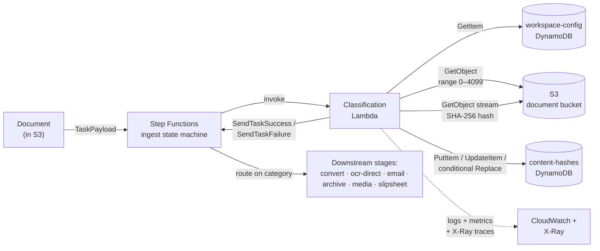
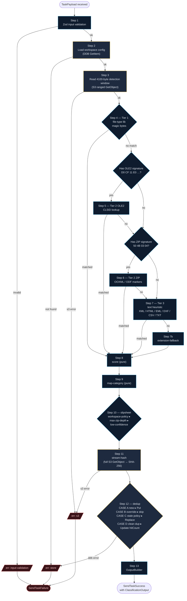

# Classification Service

First decision point in the document-ingestion pipeline. For every file entering the pipeline, this AWS Lambda service answers:

1. **What is this file, really?** — multi-tier binary detection (independent of extension/MIME)
2. **Have we already processed it?** — SHA-256 content-hash deduplication, scoped per workspace
3. **Where does it go next?** — category routing into one of `convert | ocr-direct | email | archive | media | slipsheet`

## System context



## Classification pipeline

Per-document execution, 13 steps inside `ClassificationService.classify()`:



**Legend** — blue = pure domain logic; amber = I/O step (S3 / DDB); red = failure path (returns `Result.err`).

### Sequence — single classify invocation

Actor-level view of the same flow over time. AWS-side actors only show round-trip calls; pure domain steps are collapsed into a single `Lambda` self-note to keep the focus on I/O contracts.

```mermaid
sequenceDiagram
    autonumber
    participant SFN as Step Functions
    participant L  as Classification Lambda
    participant WC as DDB workspace-config
    participant S3 as S3 document bucket
    participant CH as DDB content-hashes

    SFN->>+L: invoke(TaskPayload)<br/>{taskToken, workspaceId, documentId, s3, hints, context}

    Note over L: Step 1 — Zod input validation (pure)

    L->>+WC: GetItem(workspaceId) — ConsistentRead
    WC-->>-L: WorkspaceConfig<br/>{policyVersion, threshold, maxZipDepth,<br/>quarantineMacros, slipsheetRules, hashTtlDays}

    L->>+S3: GetObject(Range: bytes=0-4099)
    S3-->>-L: detection window (≤ 4100 bytes)

    Note over L: Steps 4–10 — pure pipeline<br/>tier 1/2/3 detection · score ·<br/>category · slipsheet decision

    L->>+S3: GetObject (full body — streamed)
    S3-->>-L: streamed body
    Note over L: Step 11 — SHA-256 hash<br/>over the stream (no full buffer)

    L->>+CH: GetItem({workspaceId, contentHash})
    CH-->>-L: existing record or null

    alt CASE A — no existing record
        L->>+CH: PutItem(record) — ConditionExpression<br/>attribute_not_exists(contentHash)
        CH-->>-L: written | already-existed
    else CASE B — context.overrideDuplicateCheck = true
        Note over L: skip persistence;<br/>isDuplicate = true
    else CASE C — existing.policyVersion ≠ config.policyVersion
        L->>+CH: Replace — Conditional on stale policyVersion
        CH-->>-L: replaced | conditional-check-failed
    else CASE D — clean duplicate
        L->>+CH: UpdateItem — increment hitCount,<br/>set lastSeenAt
        CH-->>-L: updated
    end

    Note over L: Step 13 — OutputBuilder<br/>{classification, dedup, policyVersion}

    alt success
        L->>SFN: SendTaskSuccess(output)
    else failure (any step → Result.err)
        L->>SFN: SendTaskFailure({errorCode, errorMessage})
    end
    deactivate L
```

Read the numbered arrows top-to-bottom to walk through one invocation. The `alt` blocks show the four dedup cases (mutually exclusive) and the success/failure tail. Every Lambda → AWS arrow is one network call; `S3` appears twice (range read for detection, full-body stream for hash) because they're independent requests.

## Architecture

Hexagonal (Ports & Adapters):

```
src/
├── domain/      pure logic — file-type detection, scoring, slipsheet rules
├── ports/       interface contracts (S3Reader, ContentHashStore, Logger, …)
├── adapters/    AWS SDK implementations of ports
├── application/ the ClassificationService orchestrator
├── handler/     Lambda entry point — the only place adapters get wired
└── shared/      Result<T,E>, type aliases, byte utilities
infra/           AWS CDK stacks (Lambda, DynamoDB, CloudWatch, X-Ray)
tests/
├── unit/        example-based tests on pure domain logic
├── pbt/         property-based tests with fast-check
├── perf/        Vitest benchmarks
├── integration/ LocalStack-backed adapter + handler tests
├── fixtures/    binary fixtures for AC-1..AC-11
└── regression/  auto-captured PBT shrunk failures
ui/              Next.js 14 test dashboard (Docker + dev EKS deployable)
├── app/         App Router pages + API routes (classify, workspaces, health, stats)
├── components/  Dashboard / ClassifyForm / WorkspaceForm / KpiTile / Pill
├── lib/         classifier wiring (LocalStack-pointed) + stats counter
├── cypress/     E2E specs (smoke + per-tier + pagination + s3:unknown regression)
└── k8s/         Manifests for dev EKS
LOCAL_TESTING.md Developer-facing LocalStack + SAM Local guide
```

## Quickstart (developer)

Prerequisites: Node 20+, npm.

```bash
npm install                 # install deps (file-type + dev tooling)
npm run typecheck           # tsc --noEmit (strict-plus flags)
npm run lint                # ESLint with boundary rules
npm run test:unit           # Vitest unit tests (no LocalStack)
npm run test:pbt            # fast-check property tests
npm run test:integration    # LocalStack via testcontainers (Docker required)
npm run test:infra          # CDK stack assertions
npm run test:coverage       # full coverage report
npm run bench               # perf benchmarks (5 ms p99 budget on U-1)
npx cdk synth -c env=dev    # synthesize CloudFormation for dev/staging/prod
```

### Make-based workflow

The repo ships a Makefile that wraps the npm/cdk commands above with prerequisite checks and grouped help. Recommended daily flow:

```bash
make help            # Show every grouped target
make qa-quick        # ~15 s  — lint + typecheck + npm audit (pre-commit)
make qa              # ~2 min — full gate: + unit + pbt + infra + cdk synth (pre-push)
make qa-ui           # UI subtree: Next tsc + Next lint + Cypress E2E
make security        # npm audit + cdk-nag findings from cdk synth (pre-deploy)
make ci              # mirror of CI's non-Docker suite
make all             # everything incl. LocalStack integration + SAM Local smoke
```

Targets are grouped in `make help` under: Setup, Build & static checks, Test, **QA & security**, Composite, Housekeeping.

For exercising the service against real files locally, see **[`LOCAL_TESTING.md`](LOCAL_TESTING.md)** — two modes (Vitest integration via testcontainers, or SAM Local + long-lived LocalStack) with step-by-step instructions, table provisioning, and a troubleshooting matrix.

## Interactive Test UI

`ui/` contains a Next.js 14 dashboard that wraps `ClassificationService` for visual / interactive testing — drag-drop a file, see the classification JSON, recent results table with pagination, KPI tiles for tier breakdown.

```bash
docker compose -f ui/docker-compose.yml up -d --build   # LocalStack + UI on :3000
open http://localhost:3000
```

Three deployment modes (`npm run dev`, Docker Compose, dev EKS via `kubectl apply -f ui/k8s/`) and Cypress E2E suite documented in **[`ui/README.md`](ui/README.md)**. Operations-phase summary at `aidlc-docs/operations/test-ui.md`.

## Documentation

Full design captured under `aidlc-docs/`:

- `aidlc-state.md` — current workflow position
- `audit.md` — append-only chronological log of every workflow interaction
- `inception/requirements/requirements.md` — 10 FRs, 10 NFRs, 11 ACs
- `inception/application-design/application-design.md` — component map
- `construction/{classifier-core,persistence,handler,infrastructure}/` — per-unit design + code summaries
- `construction/build-and-test/` — playbooks for build / unit / integration / performance / overall readiness
- `operations/test-ui.md` — the test UI dashboard (this section's `ui/`) as an operations artifact

## Status

AI-DLC workflow **complete**: INCEPTION (7 stages) + CONSTRUCTION (4 units × 5 stages + Build & Test) + OPERATIONS (placeholder with the test-UI tooling delivered on top).

Service is production-ready pending the 6-item operator hand-off in `aidlc-docs/construction/build-and-test/build-and-test-summary.md` §7 (CDK Bootstrap, OIDC roles, SNS topic SSM seed, GitHub `environment: prod` protection, first deploys).
