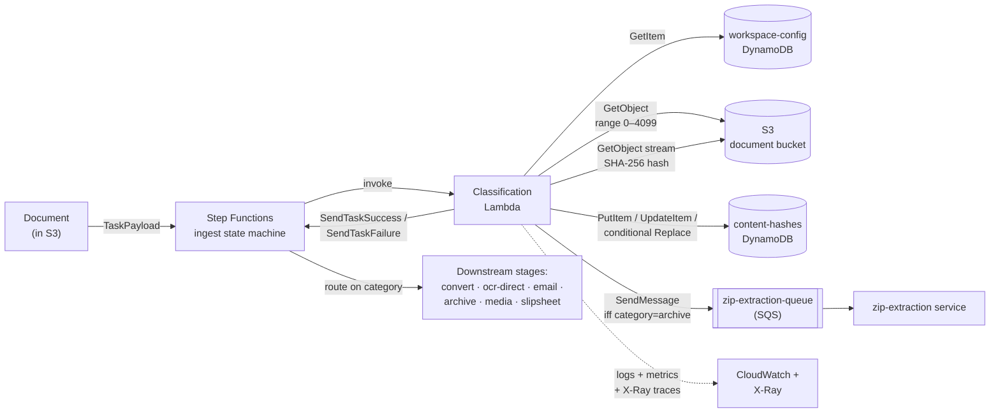

# Document Uploader Classification Service


First decision point in the document-ingestion pipeline. For every file entering the pipeline, this AWS Lambda service answers:

1. **What is this file, really?** — multi-tier binary detection (independent of extension/MIME)
2. **Have we already processed it?** — SHA-256 content-hash deduplication, scoped per workspace
3. **Where does it go next?** — category routing into one of `convert | ocr-direct | email | archive | media | slipsheet`

## System context



**Archive fan-out** (`ZIP_EXTRACTION_QUEUE_URL`): when classification returns `category=archive` (e.g. for a `.zip`), the Lambda publishes a claim-check `{pipelineExecutionId, tenantId, documentId, sourceBucket, sourceKey, correlationId}` to the [zip-extraction service](../zip-extraction/services/zip-extraction/)'s SQS queue. Dispatch failures are logged but do not block the `SendTaskSuccess` callback — classification's primary contract is preserved. The fan-out is opt-in: an empty `ZIP_EXTRACTION_QUEUE_URL` disables it without code changes.

## Architecture

Hexagonal (Ports & Adapters):

```
src/
├── domain/      pure logic — file-type detection, scoring, slipsheet rules
├── ports/       interface contracts (S3Reader, ContentHashStore, Logger, …)
├── adapters/    AWS SDK implementations of ports
├── application/ the ClassificationService orchestrator
├── handler/     Lambda entry point — the only place adapters get wired
└── shared/      Result<T,E>, type aliases, byte utilities
infra/           AWS CDK stacks (Lambda, DynamoDB, CloudWatch, X-Ray)
tests/
├── unit/        example-based tests on pure domain logic
├── pbt/         property-based tests with fast-check
├── perf/        Vitest benchmarks
├── integration/ LocalStack-backed adapter + handler tests
├── fixtures/    binary fixtures for AC-1..AC-11
└── regression/  auto-captured PBT shrunk failures
ui/              Next.js 14 test dashboard (Docker + dev EKS deployable)
├── app/         App Router pages + API routes (classify, workspaces, health, stats)
├── components/  Dashboard / ClassifyForm / WorkspaceForm / KpiTile / Pill
├── lib/         classifier wiring (LocalStack-pointed) + stats counter
├── cypress/     E2E specs (smoke + per-tier + pagination + s3:unknown regression)
└── k8s/         Manifests for dev EKS
LOCAL_TESTING.md Developer-facing LocalStack + SAM Local guide
```

## Quickstart (developer)

Prerequisites: Node 20+, npm.

```bash
npm install                 # install deps (file-type + dev tooling)
npm run typecheck           # tsc --noEmit (strict-plus flags)
npm run lint                # ESLint with boundary rules
npm run test:unit           # Vitest unit tests (no LocalStack)
npm run test:pbt            # fast-check property tests
npm run test:integration    # LocalStack via testcontainers (Docker required)
npm run test:infra          # CDK stack assertions
npm run test:coverage       # full coverage report
npm run bench               # perf benchmarks (5 ms p99 budget on U-1)
npx cdk synth -c env=dev    # synthesize CloudFormation for dev/staging/prod
```

### Make-based workflow

The repo ships a Makefile that wraps the npm/cdk commands above with prerequisite checks and grouped help. Recommended daily flow:

```bash
make help            # Show every grouped target
make qa-quick        # ~15 s  — lint + typecheck + npm audit (pre-commit)
make qa              # ~2 min — full gate: + unit + pbt + infra + cdk synth (pre-push)
make qa-ui           # UI subtree: Next tsc + Next lint + Cypress E2E
make security        # npm audit + cdk-nag findings from cdk synth (pre-deploy)
make ci              # mirror of CI's non-Docker suite
make all             # everything incl. LocalStack integration + SAM Local smoke
```

Targets are grouped in `make help` under: Setup, Build & static checks, Test, **QA & security**, Composite, Housekeeping.

For exercising the service against real files locally, see **[`LOCAL_TESTING.md`](LOCAL_TESTING.md)** — two modes (Vitest integration via testcontainers, or SAM Local + long-lived LocalStack) with step-by-step instructions, table provisioning, and a troubleshooting matrix.

## Interactive Test UI

`ui/` contains a Next.js 14 dashboard that wraps `ClassificationService` for visual / interactive testing — drag-drop a file, see the classification JSON, recent results table with pagination, KPI tiles for tier breakdown.

```bash
docker compose up -d --build                            # full stack — see below
open http://localhost:3000
```

The root `docker-compose.yml` brings up the **whole local stack** in one command:

| Service | Image | Endpoint | Purpose |
|---|---|---|---|
| `localstack` | `localstack/localstack:3.7.0` | `:4566` | S3 + DynamoDB + Step Functions + SQS |
| `bootstrap` | `amazon/aws-cli:2.17.0` | one-shot | Seeds the bucket, both tables, the default workspace row, and the `zip-extraction-queue` |
| `lambda` | built from `Dockerfile.lambda` | `:9000` | Bundled handler running under the AWS Lambda RIE — invoke with `POST /2015-03-31/functions/function/invocations` |
| `ui` | built from `ui/Dockerfile` | `:3000` | Next.js test dashboard |

The UI exercises the classifier in-process; the Lambda container is there so the deployed-Lambda code path is locally invocable (smoke / regression) without SAM Local.

Three deployment modes (`npm run dev`, Docker Compose, dev EKS via `make deploy-dev`) and Cypress E2E suite documented in **[`ui/README.md`](ui/README.md)**. Operations-phase summary at `aidlc-docs/operations/test-ui.md`.

**API contract**: OpenAPI 3.1 spec at [`ui/public/openapi.yaml`](ui/public/openapi.yaml), browsable Swagger UI at `<host>/docs` (e.g. `https://classification-ui-dev-sandbox-v1.dev05.k8s.opus2dev.com/docs`). Single endpoint to attach-a-file-get-result is `POST /api/classify` (multipart, returns classification JSON).

For the shared dev cluster (DEV05-EKS-CLUSTER, namespace `classification-service-sandbox`), see **[`deploy/README.md`](deploy/README.md)** — Helm chart + `make deploy-dev` / `make undeploy-dev` pipelines + port-forward and optional ALB+Route 53 wiring.

## Documentation

Full design captured under `aidlc-docs/`:

- `aidlc-state.md` — current workflow position
- `audit.md` — append-only chronological log of every workflow interaction
- `inception/requirements/requirements.md` — 10 FRs, 10 NFRs, 11 ACs
- `inception/application-design/application-design.md` — component map
- `construction/{classifier-core,persistence,handler,infrastructure}/` — per-unit design + code summaries
- `construction/build-and-test/` — playbooks for build / unit / integration / performance / overall readiness
- `operations/test-ui.md` — the test UI dashboard (this section's `ui/`) as an operations artifact

## Status

AI-DLC workflow **complete**: INCEPTION (7 stages) + CONSTRUCTION (4 units × 5 stages + Build & Test) + OPERATIONS (placeholder with the test-UI tooling delivered on top).

Service is production-ready pending the 6-item operator hand-off in `aidlc-docs/construction/build-and-test/build-and-test-summary.md` §7 (CDK Bootstrap, OIDC roles, SNS topic SSM seed, GitHub `environment: prod` protection, first deploys).
