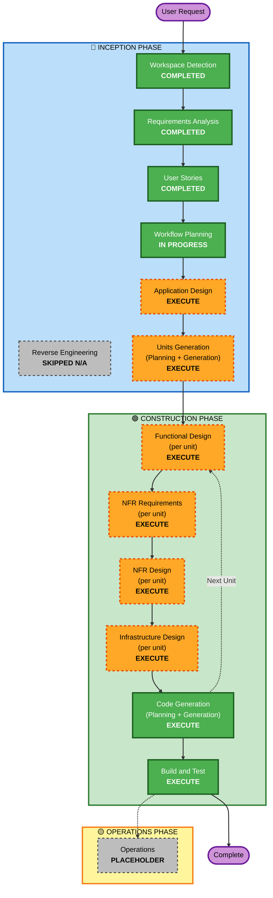

# Execution Plan — Classification Service

> Workflow planning artifact for the AI-DLC INCEPTION → CONSTRUCTION transition. Locks in which stages execute, in what order, organised into how many units.

---

## 1. Detailed Analysis Summary

### 1.1 Project Profile
- **Project Type**: Greenfield
- **Domain**: Document classification — first decision point in a document-ingestion pipeline
- **Runtime**: AWS Lambda (Node.js 20.x+ / TypeScript strict)
- **Integrations**: S3 (ranged GET + streaming hash), DynamoDB (`content-hashes` + `workspace-config`), Step Functions (task-token callback), CloudWatch + X-Ray
- **Extensions enabled (blocking)**: SECURITY baseline, Property-Based Testing

### 1.2 Change Impact Assessment

| Impact Area | Affected? | Detail |
|---|---|---|
| User-facing changes | Yes | 6 distinct personas (Pipeline Orchestrator, Workspace Operator, Document Ingestion Owner, Downstream Branch Maintainer, Service Developer, On-Call SRE) — 28 user stories |
| Structural changes | Yes | Greenfield service architecture: multi-tier classifier + dedup + workspace-config + Step Function integration |
| Data model changes | Yes | Two new DynamoDB tables (`content-hashes`, `workspace-config`) with explicit schemas + policy-version semantics + per-workspace TTL |
| API changes | Yes | Step Function input payload (§4.1) + `SendTaskSuccess`/`SendTaskFailure` output (§4.2) define the service's contract |
| NFR impact | Yes | 10 NFRs cover streaming I/O, workspace isolation, determinism, observability (CloudWatch + X-Ray), retry policy, concurrency, per-workspace TTL |

### 1.3 Component Relationships (greenfield — no prior components)
Since this is a greenfield service, "component relationships" describe the to-be architecture rather than prior dependencies:

- **Primary Component**: Classification Service (this build)
- **External Dependencies**:
  - **Upstream**: AWS Step Function State Machine (caller)
  - **Persistence**: AWS DynamoDB (`content-hashes`, `workspace-config`)
  - **Object Storage**: AWS S3 (document source)
  - **Observability**: AWS CloudWatch Logs/Metrics/Alarms + AWS X-Ray
  - **Downstream**: Six Step Function branches (`convert`, `ocr-direct`, `email`, `archive`, `media`, `slipsheet`)

### 1.4 Risk Assessment

| Dimension | Level | Rationale |
|---|---|---|
| Risk Level | **Medium-High** | Security-relevant entry point handling untrusted binary input (malformed OLE2, ZIP bombs, macro-borne malware). Mixed-endian CLSID parsing is a known bug source. However, scope is well-bounded (one Lambda + 2 tables) and rollback is straightforward (re-deploy previous Lambda version). |
| Rollback Complexity | Easy | Single Lambda; previous version retainable via Lambda aliases. DynamoDB schema is additive (TTL + new attributes). |
| Testing Complexity | High | 11 acceptance criteria + property-based tests for mixed-endian CLSID and scoring math + LocalStack-backed integration. PBT extension requires property identification at functional design (PBT-01) and framework wiring (PBT-09). |

---

## 2. Workflow Visualization

### 2.1 Mermaid Flowchart



### 2.2 Text Alternative (fallback)

```
🔵 INCEPTION PHASE
   - Workspace Detection (COMPLETED)
   - Reverse Engineering (SKIPPED — greenfield)
   - Requirements Analysis (COMPLETED — 23 questions, requirements.md generated)
   - User Stories (COMPLETED — 6 personas, 28 stories)
   - Workflow Planning (IN PROGRESS — this document)
   - Application Design (EXECUTE — service architecture from scratch)
   - Units Generation (EXECUTE — 4 logical units identified)

🟢 CONSTRUCTION PHASE (per-unit loop for each of 4 units)
   - Functional Design (EXECUTE per unit — PBT-01 mandates property identification)
   - NFR Requirements (EXECUTE per unit — tech stack + observability + security)
   - NFR Design (EXECUTE per unit — streaming, retry, encryption, logging patterns)
   - Infrastructure Design (EXECUTE per unit — AWS resource mapping)
   - Code Generation (EXECUTE per unit — always)
   - Build and Test (EXECUTE — once at end, covers all units + integration)

🟡 OPERATIONS PHASE
   - Operations (PLACEHOLDER — future)
```

---

## 3. Phases to Execute

### 🔵 INCEPTION PHASE
- [x] Workspace Detection (COMPLETED) — greenfield confirmed
- [x] Reverse Engineering (SKIPPED) — N/A for greenfield
- [x] Requirements Analysis (COMPLETED) — 23 questions answered; `requirements.md` consolidates 10 FRs + 10 NFRs + 11 ACs + extension compliance summaries
- [x] User Stories (COMPLETED) — 6 personas + 28 stories with full traceability matrix
- [x] Workflow Planning (IN PROGRESS) — this document
- [ ] **Application Design** — **EXECUTE**
  - **Rationale**: Greenfield service from scratch. Need to identify components (classifier core, persistence, handler, infrastructure), define service boundaries, and map components to FR/NFR ownership. Per CLAUDE.md: "New components or services needed" + "Service layer design required" + "Component dependencies need clarification".
- [ ] **Units Generation** — **EXECUTE**
  - **Rationale**: Service decomposes naturally into 4 units that can be developed semi-independently. Per CLAUDE.md: "System needs decomposition into multiple units of work" + "Multiple services or modules required" + "Complex system requiring structured breakdown".

### 🟢 CONSTRUCTION PHASE (per-unit loop)
- [ ] **Functional Design (per unit)** — **EXECUTE**
  - **Rationale**: Complex business logic per unit (tier fallback in classifier-core; conditional-write semantics in persistence; streaming hash + Step Function callback in handler). **Mandated by PBT-01** — properties must be identified at functional design time. Per CLAUDE.md: "New data models or schemas" + "Complex business logic" + "Business rules need detailed design".
- [ ] **NFR Requirements (per unit)** — **EXECUTE**
  - **Rationale**: 10 NFRs touching streaming, observability, retry, encryption, concurrency, determinism. **Mandated by PBT-09** — tech-stack selection must include `fast-check` framework. **Mandated by SECURITY extension** — security baseline must be assessed per unit. Per CLAUDE.md: "Performance requirements exist" + "Security considerations needed" + "Tech stack selection required".
- [ ] **NFR Design (per unit)** — **EXECUTE**
  - **Rationale**: NFR patterns need explicit incorporation: streaming SHA-256 pipeline, structured-JSON logging with correlation IDs, two-layer retry, idempotent handler, encryption-at-rest/in-transit. Conditional on NFR Requirements being executed — which it is. Per CLAUDE.md: "NFR patterns need to be incorporated".
- [ ] **Infrastructure Design (per unit)** — **EXECUTE**
  - **Rationale**: Full AWS infrastructure-as-code needed: Lambda function + layers, two DynamoDB tables, IAM roles (least-privilege per SECURITY-06), VPC + private endpoints (per SECURITY-07), CloudWatch alarms + log groups (per SECURITY-14), X-Ray service map. Per CLAUDE.md: "Infrastructure services need mapping" + "Deployment architecture required" + "Cloud resources need specification".
- [ ] **Code Generation (per unit)** — **EXECUTE** (always)
  - **Rationale**: Implementation planning and code generation per unit. Part 1 (Planning) creates explicit step checklist; Part 2 (Generation) writes TypeScript code, Vitest tests, `fast-check` property tests, and IaC.
- [ ] **Build and Test** — **EXECUTE** (always)
  - **Rationale**: Builds all 4 units; runs unit tests, PBT, LocalStack-backed integration tests against the 11 ACs, and SAM Local smoke tests; produces test report and ship-readiness assessment.

### 🟡 OPERATIONS PHASE
- [ ] Operations — **PLACEHOLDER** (future deployment + monitoring workflows; not part of this build cycle)

---

## 4. Proposed Unit Decomposition

The service is decomposed into **4 logical units** (one Construction-phase per-unit loop iteration per unit). This is a recommendation; final unit boundaries are confirmed during Application Design and Units Generation stages.

| # | Unit | Scope | Key FRs/NFRs | Key Stories |
|---|---|---|---|---|
| 1 | **classifier-core** | Pure detection logic (no AWS deps): `file-type` integration, OLE2 CLSID custom layer, ZIP OOXML/ODF marker detection, text heuristic, scoring math, category/sub-category mapping | FR-1, FR-2, FR-3, FR-4, FR-5, FR-6, FR-6.1, NFR-5 | US-DI-001, US-DB-001..005, US-SD-002, US-SD-004 |
| 2 | **persistence** | DynamoDB access for `content-hashes` (conditional writes, policy-version comparison, TTL) and `workspace-config` (read-once-per-invocation with caching) | FR-7, FR-7.1, FR-7.2, FR-7.3, NFR-4, NFR-10 | US-DI-002, US-DI-003, US-WO-001..005 |
| 3 | **handler** | Lambda entry point: input validation, S3 ranged GET, streaming SHA-256, orchestration of classifier-core + persistence, slipsheet decision, Step Function callbacks (`SendTaskSuccess`/`SendTaskFailure`), retry coordination, structured logging, X-Ray instrumentation | FR-7, FR-8, FR-8.1, FR-9, FR-10, NFR-1, NFR-2, NFR-3, NFR-7, NFR-8, NFR-9 | US-PO-001..004, US-DI-004, US-SRE-001, US-SRE-002 |
| 4 | **infrastructure** | IaC for Lambda, DynamoDB tables, IAM roles, VPC + endpoints, CloudWatch alarms + dashboards, X-Ray, secrets/parameter store. Implements SECURITY-01 (encryption), SECURITY-06 (least-privilege), SECURITY-07 (network), SECURITY-09 (hardening), SECURITY-10 (supply chain), SECURITY-14 (alerting) | All SECURITY rules with infrastructure surface, NFR-8 | US-SRE-003, US-SRE-004 |

### 4.1 Unit Sequencing
Units will progress through Construction in this order, since later units depend on earlier ones:

1. **classifier-core** (no deps; pure logic — testable in isolation)
2. **persistence** (depends on table schemas; can develop alongside classifier-core)
3. **handler** (composes classifier-core + persistence)
4. **infrastructure** (deploys all of the above; can begin in parallel with handler once IAM scope is known)

### 4.2 Adaptive Detail per Unit
- **classifier-core**: Comprehensive depth (high complexity, PBT-heavy, foundational)
- **persistence**: Standard depth (well-understood patterns; security-critical)
- **handler**: Comprehensive depth (orchestration, error handling, observability all converge here)
- **infrastructure**: Standard depth (IaC patterns; security baseline drives rules)

---

## 5. Estimated Timeline (Indicative)

> Estimates are work-effort indicative, not calendar time. Actual cadence depends on review depth and any iteration needed at gates.

| Stage | Effort (relative) |
|---|---|
| Application Design | Small |
| Units Generation | Small |
| Per-unit Construction loop (×4 units) | Large — bulk of work |
| Build and Test | Medium |
| **Total** | Medium-Large |

The bulk of effort lives in the per-unit Construction loops. Each loop runs through Functional Design → NFR Requirements → NFR Design → Infrastructure Design → Code Generation, with explicit approval gates between stages.

---

## 6. Success Criteria

- **Primary Goal**: A production-ready Classification Service Lambda + supporting AWS infrastructure that satisfies all 10 FRs, 10 NFRs, 11 ACs, and the SECURITY + PBT extension rules.
- **Key Deliverables**:
  - TypeScript source for 4 units (`src/classifier/`, `src/persistence/`, `src/handler/`, `infra/`)
  - Vitest unit + PBT (`fast-check`) tests with ≥90% branch coverage on classifier and ≥70% on integration
  - LocalStack-backed integration tests covering AC-1…AC-11
  - SAM Local smoke test harness
  - IaC (CDK or Terraform — locked in at NFR Requirements stage) for all AWS resources
  - CloudWatch dashboards + alarms wired per SECURITY-14
  - Documentation: per-unit design docs + build-and-test instructions
- **Quality Gates**:
  - All applicable SECURITY-01..15 rules compliant or marked N/A with rationale
  - All applicable PBT-01..10 rules compliant or marked N/A with rationale
  - All 11 ACs pass in integration test suite
  - SAM Local smoke test passes against LocalStack
  - Coverage thresholds (90% classifier, 70% integration glue) met
  - No critical or high-severity dependency CVEs (`npm audit` clean)

---

## 7. Package / Module Sequence

Greenfield → no prior module update sequence. The unit sequence in §4.1 governs build order.
